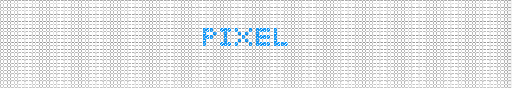

# pixel.js
> 一个非常无聊的库; 将页面填充满`checkbox`, 通过控制其状态构成像素画面

### 开始

`script`标签直接引入就可以了, 无需任何依赖

```
...
<body>
    <script src="pixel.js"></script>
    <script>
        ...
    </script>
</body>
</html>
```

### jQuery like

使用类似`jQuery`

```
<body>
    <script src="pixel.js"></script>
    <script>
        let demo = $('PIXEL');
        demo.show();
    </script>
</body>
```


### 一些效果

类似`jQuery`, 也有一些动画效果

```
<body>
    <script src="pixel.js"></script>
    <script>
        $(() => {
            let demo = $('PIXEL IS COOL');
            demo.print().fadeOut().slideDown().slideUp().fadeIn().shake().shine()
        })
    </script>
</body>
```
<video src="./img/2.mov" controls autoplay loop width=855></video>

### 还能干啥

* 绘画

1.画内容

```
<body>
    <script src="pixel.js"></script>
    <script>
        $.draw()
    </script>
</body>
```
<video src="./img/3.mov" controls autoplay loop width=855></video>

2.控制台, 通过`$.output()`获取数据;

3.使用获取到的二位数组;

```
<body>
    <script src="pixel.js"></script>
    <script>
        let fuck = $([[-32,-14],[-31,-14],[-29,-14],[-40,-13],[-39,-13],[-37,-13],[-26,-13],[-41,-12],[-40,-12],[18,-12],[-41,-11],[18,-11],[-41,-10],[18,-10],[-41,-9],[18,-9],[33,-9],[18,-8],[32,-8],[-41,-7],[31,-7],[-41,-6],[5,-6],[7,-6],[31,-6],[-41,-5],[3,-5],[4,-5],[30,-5],[-17,-4],[-6,-4],[3,-4],[18,-4],[29,-4],[-40,-3],[2,-3],[-40,-2],[-31,-2],[-30,-2],[-29,-2],[-27,-2],[-26,-2],[-6,-2],[2,-2],[18,-2],[28,-2],[-40,-1],[-37,-1],[-36,-1],[-34,-1],[-17,-1],[-7,-1],[2,-1],[29,-1],[-38,0],[-7,0],[2,0],[26,0],[29,0],[-39,1],[-7,1],[3,1],[18,1],[30,1],[31,1],[-17,2],[4,2],[25,2],[32,2],[-39,3],[-16,3],[-9,3],[4,3],[18,3],[23,3],[32,3],[33,3],[-16,4],[-9,4],[5,4],[33,4],[34,4],[-15,5],[-13,5],[-12,5],[-11,5],[-10,5],[19,5],[21,5],[34,5],[-39,6],[21,6],[-38,7],[19,7],[20,7],[-38,8],[19,8],[16,11]])
        fuck.fadeIn();
    </script>
</body>
```

<video src="./img/4.mov" controls autoplay loop width=855></video>

* 当然还有录制`$.record()`与播放`$.play()`

* 甚至可以做一些游戏
<video src="./img/5.mov" controls autoplay loop width=855></video>
<video src="./img/6.mov" controls autoplay loop width=855></video>